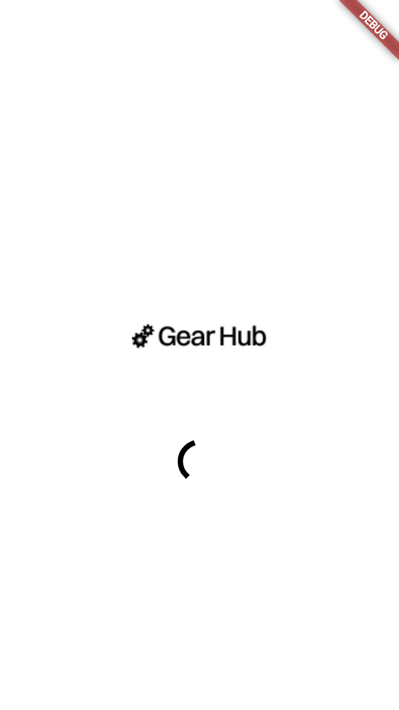
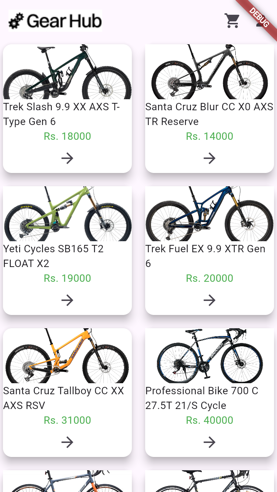
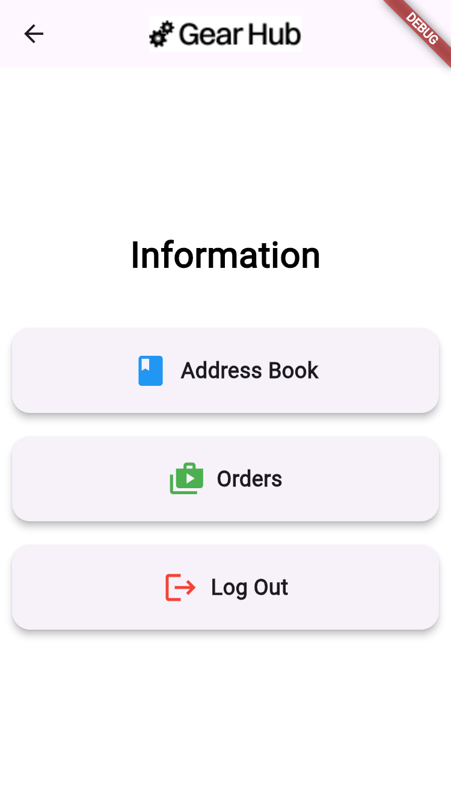

# 🚲 GearHub-Ecom-GetX-Firebase
<p align=center>

</p>

### Advanced Bicycle E-commerce Ecosystem | Bano Qabil 3.0

**GearHub** is a high-performance, full-stack e-commerce solution built specifically for the bicycle industry. This project showcases advanced mobile development concepts, moving beyond static UIs into **reactive state management** and **cloud-integrated backends**.

---

## 🚀 Tech Stack & Core Architecture
* **Framework:** [Flutter](https://flutter.dev/) (Latest Stable)
* **Backend:** [Firebase Auth](https://firebase.google.com/) (Secure Identity Management)
* **State Management:** [GetX](https://pub.dev/packages/get) (Reactive Controllers & Dependency Injection)
* **Navigation:** GetX Named Routing (Clean & Decoupled)
* **Architecture:** Modular MVC (Model-View-Controller)

---

## ✨ Advanced Features
* **🔐 Professional Auth Suite:** Secure login, account creation, and password recovery integrated directly with Firebase.
* **⚡ Reactive E-commerce Flow:** Real-time cart updates and product interactions using GetX `Obx` listeners.
* **🛣️ Centralized Routing:** A dedicated routing system to manage complex app navigation without context-heavy code.
* **🎨 Modular UI Components:** Reusable widgets like `ProductCard` and `InformationIcon` for a scalable design system.
* **🛡️ Robust Error Handling:** Integrated `toast.dart` utility for real-time user feedback on authentication and network status.

---

## 🏗️ Folder Structure
This project follows a strict modular structure to ensure maintainability:

```text
lib/
├── firebase_auth/          # Firebase Authentication Logic
│   └── firebase_auth_services.dart
├── global/
│   └── common/             # Global Reusable Components
│       └── toast.dart
├── pages/                  # Main UI & Logic Layers
│   ├── app_routes.dart     # Navigation Constants
│   ├── get_routes.dart     # GetX Page Mapping
│   ├── splash_screen.dart
│   ├── constructor/        # Data Models (product_constructor.dart)
│   ├── home_pages/         # E-commerce Modules (Cart, Home, Checkout)
│   │   └── (address.dart, cart.dart, home_screen.dart, etc.)
│   └── login_pages/        # Auth Screens (Login, Signup, Forgot Pass)
│       └── (login_page.dart, create_acc.dart, etc.)
└── main.dart
````

-----

## 📱 Visual Showcase

| Authentication | Home & Catalog | Checkout & Cart |
| :---: | :---: | :---: |
|  |  |  |


-----

## ⚙️ Setup & Installation

1.  **Clone the Repository:**

    ```bash
    git clone https://github.com/SHADOWRULIN/GearHub-Ecom-GetX-Firebase.git
    ```

2.  **Add Firebase Credentials:** Place your `google-services.json` (Android) or `GoogleService-Info.plist` (iOS) in the appropriate directories.

3.  **Install Dependencies:**

    ```bash
    flutter pub get
    ```

4.  **Launch Application:**

    ```bash
    flutter run
    ```

-----

## 👤 Author

**Muhammad Fahaz Khan** 

<i>Full-Stack Flutter Developer</i>

  * **GitHub:** [@SHADOWRULIN](https://github.com/SHADOWRULIN)
  * **LinkedIn:** [Fahaz Khan](https://www.linkedin.com/in/muhammad-fahaz-khan-85b805293/)

-----

## 📄 License

This project is licensed under the **MIT License**.
